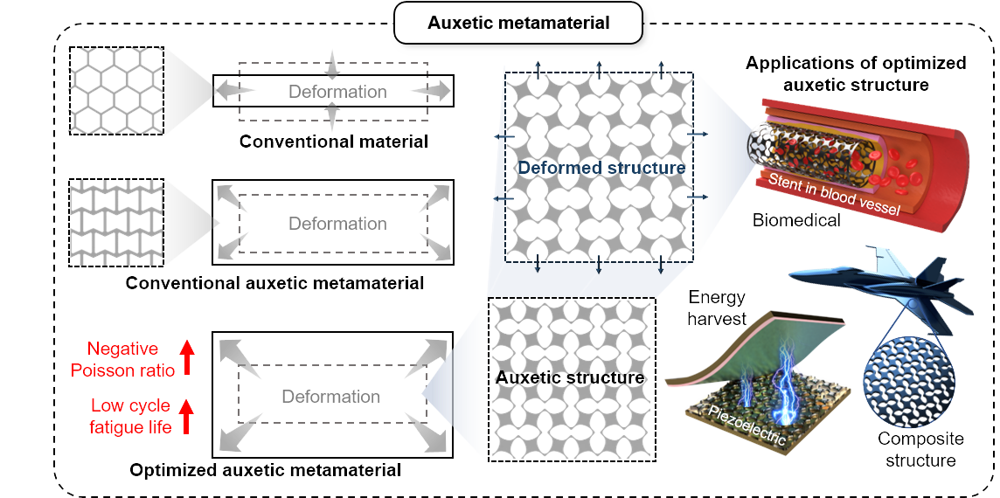
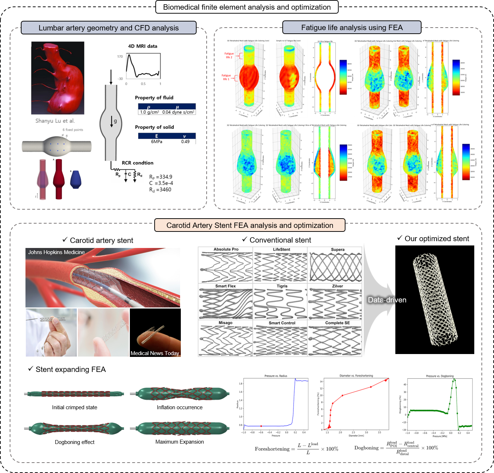

## Hello! I am Sukheon Kang

---

### Portfolio

---

#### Research Field [[Go Into LAB]](https://sites.google.com/site/seunghwalab/)

✓ Architected Materials and Mechanical Metamaterials

✓ Transformative Morphing Structures

✓ AI-based Modeling for Applications in Biomedical, Aerospace, Energy Harvesting, Energy Absorption, etc.

---

#### Education
KAIST, Ph.D., [Graduate school of MECH](https://me.kaist.ac.kr/main/main.html), Feb 2024 - Present

KAIST, M.S., [Graduate school of MECH](https://me.kaist.ac.kr/main/main.html), Feb 2022 - Feb 2024

HANYANG University, B.S., [Mechanical Engineering](http://me.hanyang.ac.kr/), Mar 2018 - Dec 2021

||GPA|Rank|Score|
|----|----|----|----|
|Cumulative|4.32|3/242|97.9|

---

#### Awards and Experiences
Hanyang academic best award, Mar 2021

National science and engineering scholarship, Aug 2020

Fourth industrial revolution program Completion, Jun 2020

Hanyang academic excellence award, Mar 2019

Samsung dream class Math-tutor program Completion, Jan 2019

Hanyang abroad student tutoring Dynamics-tutor program Completion, Jul 2020

Hanyang abroad student tutoring Mechanics of Materials-tutor program Completion, Mar 2021

Hanyang abroad student tutoring Thermodynamics-tutor program Completion, Mar 2021

Hanyang abroad student tutoring Fluid Mechanics-tutor program Completion, Jun 2021 

---

#### International Journal
 2025, Sukheon Kang, Hyeonbin Moon, Seonho Shin, Mahmoud Mousavi, Hyokyung Sung*, and Seunghwa Ryu\*, "Design of Auxetic Metamaterial for Enhanced Low Cycle Fatigue Life and Negative Poisson's ratio through Multi-objective Bayesian Optimization", Materials & Design, accepted. [Link](https://doi.org/10.1016/j.matdes.2025.113798) [Cover](images/Paper_3_cover.png)

 2024, Sukheon Kang†, Hyunggwi Song†, Hyun Seok Kang, Byeong-Soo Bae, and Seunghwa Ryu*, "Customizable Metamaterial Design for Desired Strain-Dependent Poisson's Ratio Using Constrained Generative Inverse Design Network", Materials & Design, accepted. [Link](https://doi.org/10.1016/j.matdes.2024.113377)

 2024, Junheui Jo†, Minwoo Park†, Sukheon Kang†, Hugon Lee†, Chang-Yeon Gu, Taek-Soo Kim, and Seunghwa Ryu* "Data-driven prediction of strain fields in auxetic structures and non-contact validation with Mechanoluminescence for structural health monitoring", IJAMD, accepted. [Link](https://doi.org/10.36922/ijamd.3539) [Cover](images/Paper_1_cover.jpg)

---

#### International Conference
2023, Junheui Jo, Songho Lee, Sukheon Kang and Seunghwa Ryu, "Investigation of Digital Light Printing process parameter based experimental data using simulation", ICD3DP 2023

2022, Jinwook Yeo, Sukheon Kang, Minwoo Park and Seunghwa Ryu, "Deep Learning-Based Optimization, 3D printing, and Testing of Adhesive Pillar Shape with Directionality", ENGE 2022

---

#### Domestic Conference
2024, 강석헌, 송형귀, 강현석, 배병수, 유승화, "Inverse Design of Soft Metamaterials for Tunable Poisson's Ratio Based on Strain Response", 2024 대한기계학회 본부학술대회

2024, 강석헌, 문현빈, 성효경, 유승화, "Data-driven approaches to optimize metastructure design for superior efficiency and performance", 2024 대한기계학회 CAE 및 응용역학부문 춘계학술대회

2023, 강석헌, 유승화, "Data-driven Optimization for Improved Auxetic Metamaterial Designs", 2023 한국멀티스케일역학회 심포지엄

2023, 강석헌, 문현빈, 여진욱, 박건도, 유제천, 유승화, "Design of auxetic metamaterials for Improved low cycle fatigue life and Poisson's ratio using data-driven optimization", 2023 대한기계학회 CAE 및 응용역학부문 춘계학술대회

2023, 박건도, 이준형, 강석헌, Flavia Libonati, 유승화, "3 channel tensile test for a fast estimation of fatigue strength of composite laminates", 2023 대한기계학회 신뢰성부문 춘계학술대회

2022, 박건도, 김영수, 김민기, 송치현, 강석헌, 박진규, 유승화, "Designing staggered platelet composite structure with Gaussian process regression based Bayesian optimization", 2022 대한기계학회 CAE 및 응용역학부문 춘계학술대회

---

