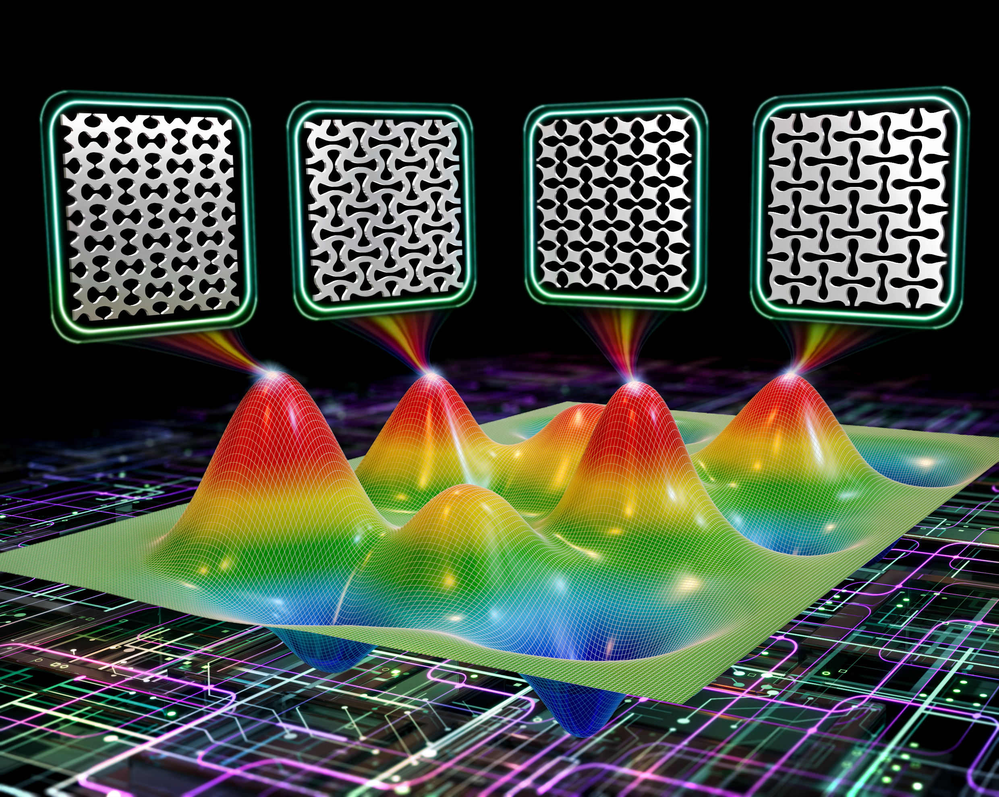
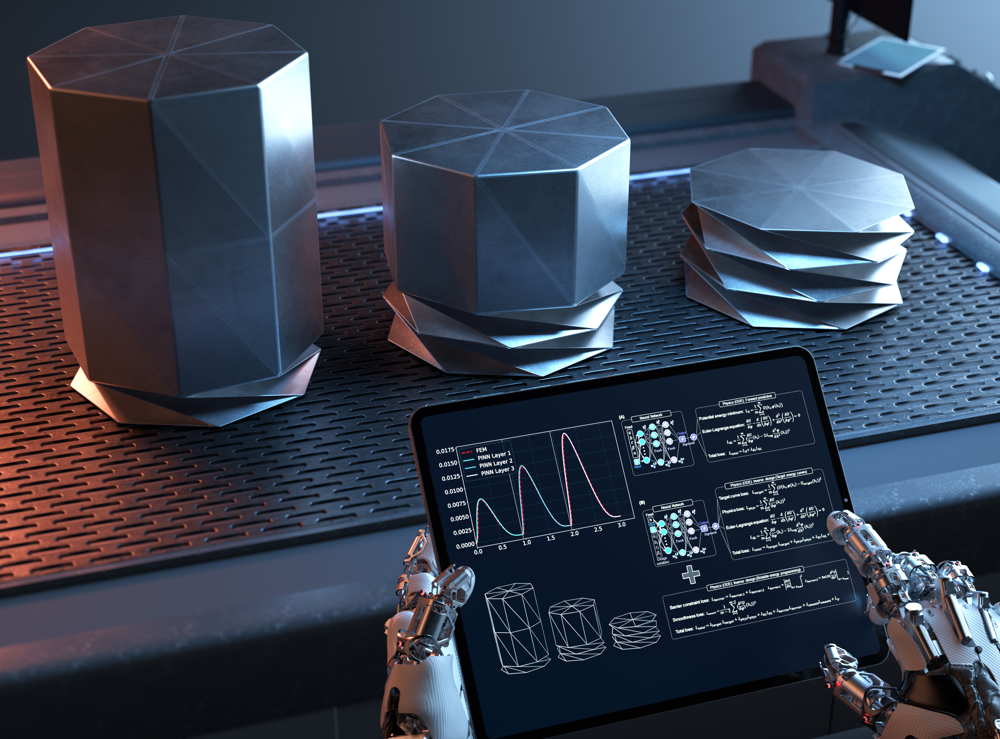
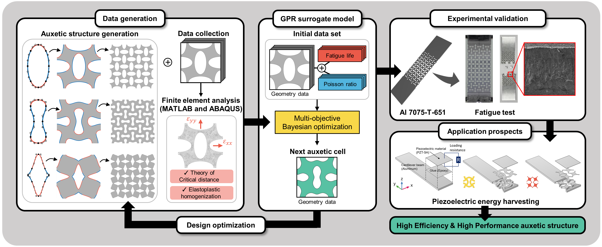
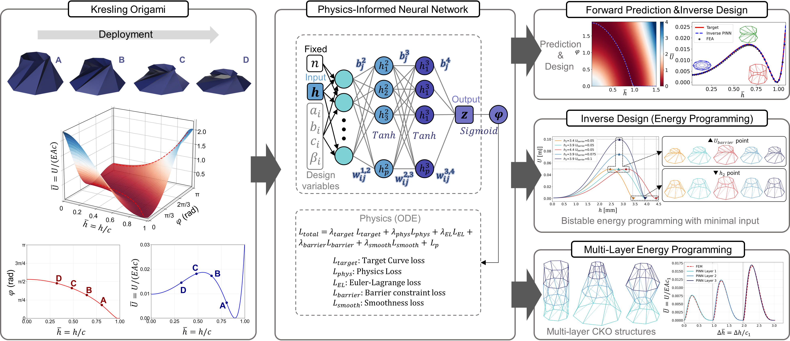
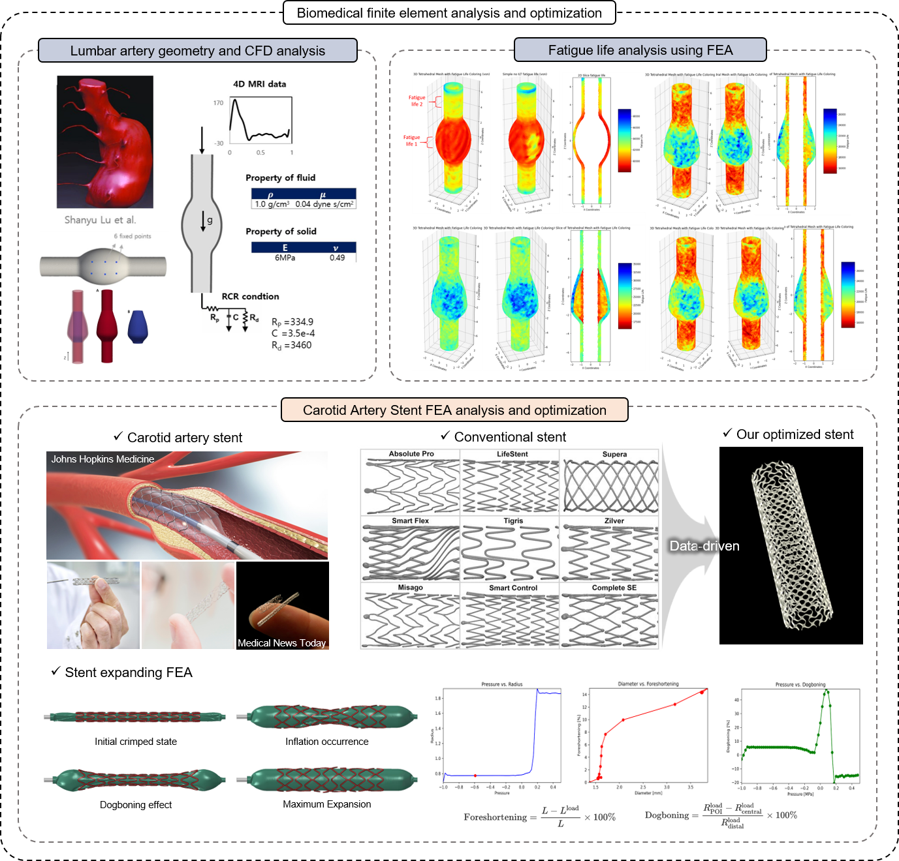

## Hello! I am Sukheon Kang

---

### Portfolio

---

#### Research Field [[Go Into LAB]](https://sites.google.com/site/seunghwalab/)

✓ Architected Materials and Mechanical Metamaterials

✓ Transformative Morphing Structures

✓ AI-based Modeling for Applications in Biomedical, Aerospace, Energy Harvesting, Energy Absorption, etc.

---

#### Education
KAIST, Ph.D., [Graduate school of MECH](https://me.kaist.ac.kr/main/main.html), Feb 2024 - Present

KAIST, M.S., [Graduate school of MECH](https://me.kaist.ac.kr/main/main.html), Feb 2022 - Feb 2024

HANYANG University, B.S., [Mechanical Engineering](http://me.hanyang.ac.kr/), Mar 2018 - Dec 2021

||GPA|Rank|Score|
|----|----|----|----|
|Cumulative|4.32|3/242|97.9|

---

#### Honors and Awards
Summa Cum Laude, Hanyang University, Feb. 2022

Hanyang Academic Excellence Award, Hanyang University, Oct. 2021 

Hanyang Academic Highest Excellence Award, Hanyang University, Apr. 2021 

Hanyang Academic Excellence Award, Hanyang University, Apr. 2019 

---

#### Scholarships
National Outstanding Scholarship for Science and Engineering,
Ministry of Science and ICT (administered by Korea Student Aid Foundation, KOSAF), Aug. 2020

---

#### International Journal
 Songho Lee†, **Sukheon Kang†**, Jecheon Yu, and Seunghwa Ryu*, "Inverse design of temperature-responsive 4D active composites using reinforcement learning", Submitted.

 **Sukheon Kang**, Youngkwon Kim, Jinkyu Yang*, and Seunghwa Ryu*, "Physics-informed neural networks for programmable origami metamaterials with controlled deployment", Materials Horizons, 12, 10641-10655, 2025. [Link](https://pubs.rsc.org/en/content/articlelanding/2025/mh/d5mh01607j) [Cover](images/Paper_4_cover.jpg)

 **Sukheon Kang**, Hyeonbin Moon, Seonho Shin, Mahmoud Mousavi, Hyokyung Sung*, and Seunghwa Ryu*, "Design of Auxetic Metamaterial for Enhanced Low Cycle Fatigue Life and Negative Poisson's ratio through Multi-objective Bayesian Optimization", Materials & Design, 252, 113798, 2025. [Link](https://doi.org/10.1016/j.matdes.2025.113798) [Cover](images/Paper_3_cover.png)

 **Sukheon Kang†**, Hyunggwi Song†, Hyun Seok Kang, Byeong-Soo Bae, and Seunghwa Ryu*, "Customizable Metamaterial Design for Desired Strain-Dependent Poisson's Ratio Using Constrained Generative Inverse Design Network", Materials & Design, 247, 113377, 2024. [Link](https://doi.org/10.1016/j.matdes.2024.113377)

 Junheui Jo†, Minwoo Park†, **Sukheon Kang†**, Hugon Lee†, Chang-Yeon Gu, Taek-Soo Kim, and Seunghwa Ryu* "Data-driven prediction of strain fields in auxetic structures and non-contact validation with Mechanoluminescence for structural health monitoring", International Journal of AI for Materials and Design, 1(2), 48-60, 2024. [Link](https://doi.org/10.36922/ijamd.3539) [Cover](images/Paper_1_cover.jpg)

---

#### International Conference
Junheui Jo, Songho Lee, **Sukheon Kang**, and Seunghwa Ryu, "Investigation of Digital Light Printing process parameter based experimental data using simulation", Proceedings of the 2nd International Conference on Design for 3D Printing (ICD3DP), Oct. 2023.

Jinwook Yeo, **Sukheon Kang**, Minwoo Park, and Seunghwa Ryu, "Deep Learning-Based Optimization, 3D printing, and Testing of Adhesive Pillar Shape with Directionality", The 7th International Conference on Electronic Materials and Nanotechnology for Green Environment (ENGE), Nov. 2022.

---

#### Domestic Conference
**Sukheon Kang**, Hyunggwi Song, Hyun Seok Kang, Byeong-Soo Bae, and Seunghwa Ryu, "A Constrained Generative Approach for Designing Metamaterials with Targeted Strain-Dependent Poisson’s Ratio", Korea Society of Mechanical Engineers (KSME) CAE and Applied Mechanics Spring Conference, 2025.

**Sukheon Kang**, Hyunggwi Song, Hyun Seok Kang, Byeong-Soo Bae, and Seunghwa Ryu, "Inverse Design of Soft Metamaterials for Tunable Poisson's Ratio Based on Strain Response", Korea Society of Mechanical Engineers (KSME) Headquarters Academic Conference Fall Conference, 2024.

**Sukheon Kang**, Hyunbin Moon, Hyokyung Sung, and Seunghwa Ryu, "Data-driven approaches to optimize metastructure design for superior efficiency and performance", Korea Society of Mechanical Engineers (KSME) CAE and Applied Mechanics Spring Conference, 2024.

**Sukheon Kang**, and Seunghwa Ryu, "Data-driven Optimization for Improved Auxetic Metamaterial Designs", Korea Multisacle Mechanics Society (KMSM) Symposium, 2023.

**Sukheon Kang**, Hyunbin Moon, Jinwook Yeo, Kundo Park, Jecheon Yu, and Seunghwa Ryu, "Design of auxetic metamaterials for Improved low cycle fatigue life and Poisson's ratio using data-driven optimization", Korea Society of Mechanical Engineers (KSME) CAE and Applied Mechanics Spring Conference, 2023.

Kundo Park, Junhyeong Lee, **Sukheon Kang**, Flavia Libonati, and Seunghwa Ryu, "3 channel tensile test for a fast estimation of fatigue strength of composite laminates", Korea Society of Mechanical Engineers (KSME) Reliability Engineering Spring Conference, 2023.

Kundo Park, Youngsoo Kim, Minki Kim, Chihyeon Song, **Sukheon Kang**, Jinkyoo Park, and Seunghwa Ryu, "Designing staggered platelet composite structure with Gaussian process regression based Bayesian optimization", Korea Society of Mechanical Engineers (KSME) CAE and Applied Mechanics Spring Conference, 2022.

---

#### Teaching Experience

Teaching Assistant
- ME231 Solid Mechanics (Prof. Seunghwa Ryu), KAIST, Feb. 2025 - Jun. 2025
- ME231 Solid Mechanics (Prof. Taek-Soo Kim), KAIST, Feb. 2024 - Jun. 2024

Mentoring and Tutoring
- Fluid Mechanics Tutor, International Student Tutoring Program, Hanyang University, Mar. 2021 – Jun. 2021
- Thermodynamics Tutor, International Student Tutoring Program, Hanyang University, Jul. 2020 – Dec. 2020
- Mechanics of Materials Tutor, International Student Tutoring Program, Hanyang University, Jul. 2020 – Dec. 2020
- Dynamics Tutor, International Student Tutoring Program, Hanyang University, Apr. 2020 – Jun. 2020
- Math Tutor & Mentor, Samsung Dream Class, Jan. 2019

---

#### Leadership
Laboratory Student Representative, Prof. Seunghwa Ryu’s Group, KAIST
Led a team of 28 researchers (Ph.D. and M.S. students), Jan 2025 – Dec 2025

---

